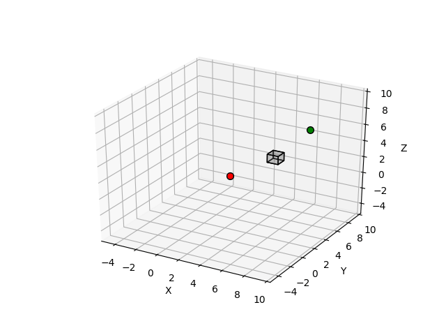
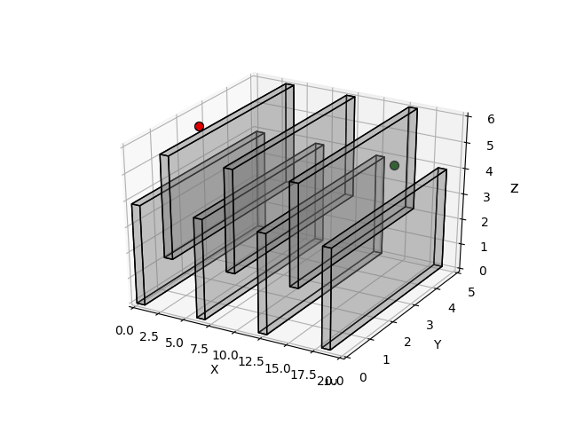
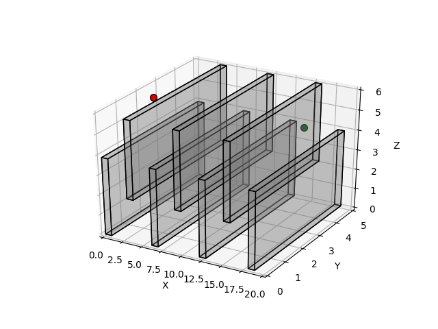
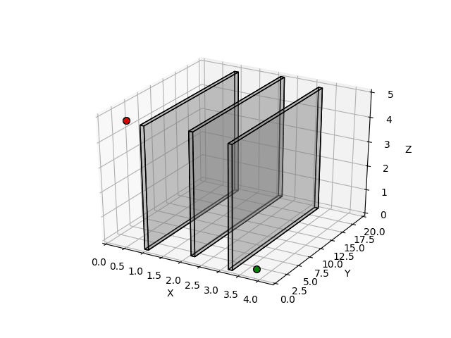
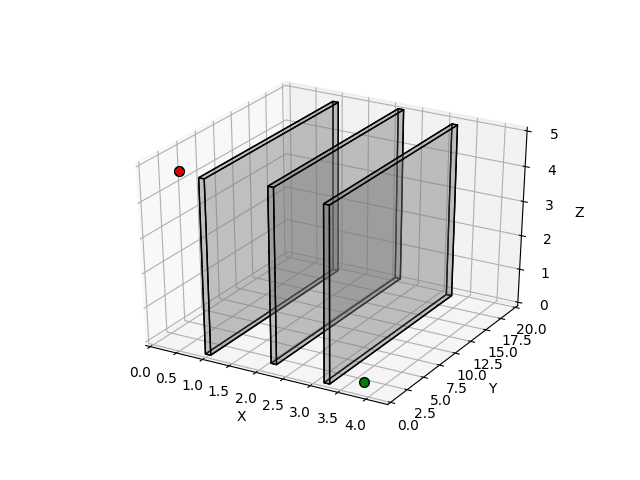
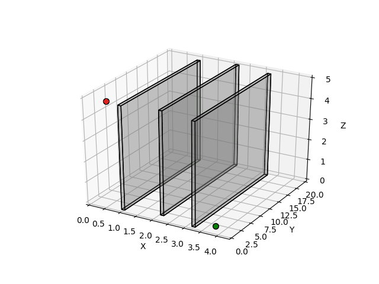

# Motion-Planning-Basics
Search-based and sampling-based planning algorithms

## Content

- [Overview](#overview)
- [Requirements & Installation](#requirements--installation)
- [Results](#results)

## Overview

Some basic search-based and sampling-based motion planning algorithms are implemented using Python including A<sup>\*</sup>, RTAA<sup>\*</sup> and RRT<sup>\*</sup> algorithm. Several maps with different difficulties are tested to compare the performance of two kinds of algorithm under different situations.

## Requirements & Installation

### Environment

- Python 3.7

### Requirements

- numpy==1.16.3
- imageio==2.5.0
- imageio-ffmpeg==0.3.0

### Installation

If you are using `Conda` for Python environment management:

```
conda create -n planning_env python==3.7
conda activate planning_env
pip install -U pip
pip install -r requirements.txt
```

## Results

Detailed problem formulation and technical approach are included in [Planning Algorithm Report.pdf](/Planning Algorithm Report.pdf). Some `.gif` results are shown below.

#### Map "single_cube":


|       RTAA<sup>\*</sup> (Euclidean heuristic)       |      RTAA<sup>\*</sup> (diagonal heuristic)       |
| :-------------------------------------------------: | :-----------------------------------------------: |
|   |  |
|          **RRT<sup>\*</sup> (unsmoothed)**          |          **RRT<sup>\*</sup> (smoothed)**          |
|  |  |


#### Map "flappy_bird":

|       RTAA<sup>\*</sup> (Euclidean heuristic)       |      RTAA<sup>\*</sup> (diagonal heuristic)       |
| :-------------------------------------------------: | :-----------------------------------------------: |
|   |  |
|          **RRT<sup>\*</sup> (unsmoothed)**          |          **RRT<sup>\*</sup> (smoothed)**          |
|  |  |


#### Map "Monza":


|    RTAA<sup>\*</sup> (Euclidean heuristic)    |   RTAA<sup>\*</sup> (diagonal heuristic)    |
| :-------------------------------------------: | :-----------------------------------------: |
|   |  |
|       **RRT<sup>\*</sup> (unsmoothed)**       |       **RRT<sup>\*</sup> (smoothed)**       |
|  |  |


